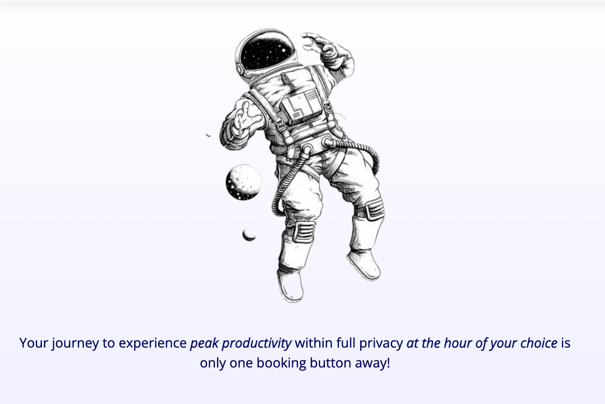
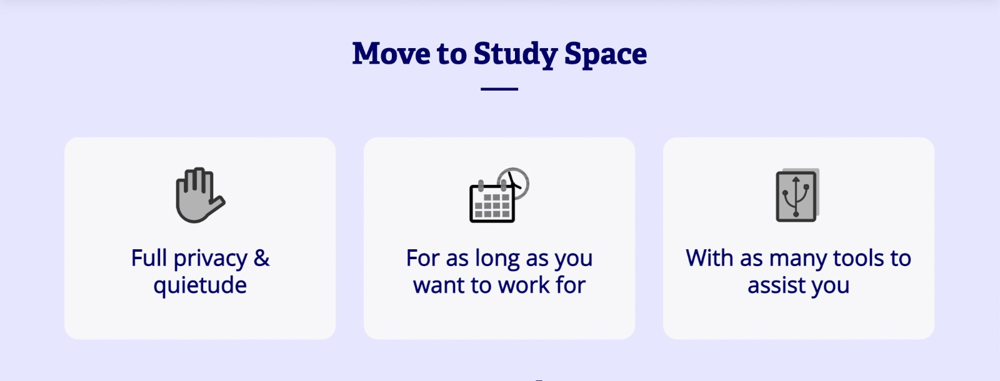

 

# Demos, Screenshots, and Example Output
we will be shearing some demos and screenshots of our project here.

## Goal:
 
 

## Project Information:

## Main Page:

## Study rooms:
*     Room Information
*     Catalog
*     Room Preview
*     Room Rating
*     Popular rooms

## User Interaction View:
*     Subscribe
*     Inquires
*     Booking
*     Receite 
*     Login Page
*     Conformation Booking
*     Sign Page

## Footer:

## Search:

## Goal:
